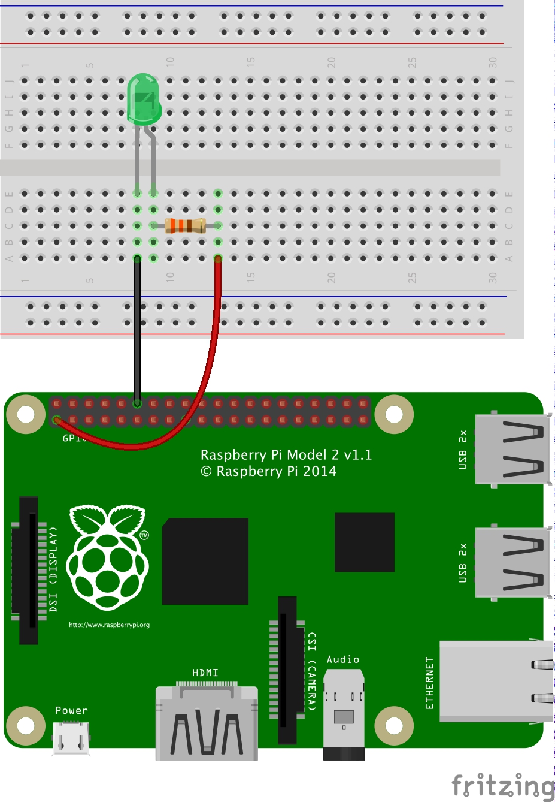

# µCast #17: Control Hardware Remotely With Socket.IO

This repository contains the source code created in [episode #17 of Microcasts](https://www.youtube.com/watch?v=z3O26CC9nAc). The purpose of the code is to illustrate a simple Internet of Things setup where an LED connected to a Raspberry Pi can be controlled from a web page via the use of web sockets.

## Hardware Setup
You can connect the LED to any GPIO pin available on your Pi. For the purposes of the video I was using an LED hooked up in the active low configuration meaning the LED will turn on when the GPIO pin is driven low.



## Fix Node on the Pi
As of January 2017 on the current Raspbian Jessie image the version of Node.js installed by running `sudo apt-get install nodejs` no longer compiles native addons correctly. This prevents the required **rpi-gpio** package to fail on npm install. To fix this you must remove any existing Node.js installation from your Pi using the following commands.

```bash
sudo apt-get remove nodejs
sudo apt-get remove npm
sudo apt-get remove nodejs-legacy
```

Once removed you can install current versions of Node by running the following:

```bash
curl -sL https://deb.nodesource.com/setup_7.x | sudo -E bash -
sudo apt-get update
sudo apt-get install nodejs
```

This will install current versions of Node and NPM.

## Server Code
The code located in the **server** folder can run locally or in a Heroku instance without any changes. To run locally just install the Node module dependencies and launch. From the **server** folder run the following commands.

```bash
npm install
npm start
```

## Client Code
The client code contained in **client/app.js** needs to be copied to your Raspberry Pi along with **client/config.js** and run there. It assumes your LED is hooked up in the active-low configuration as illustrated above. You must also modify **config.js** to indicate your LED pin and server url. Once copied to your Pi you can run the client like this:

```bash
npm install rpi-gpio
npm install socket.io-client
sudo node app.js
```

**Don't forget the 'sudo' or your client will run but lack the ability to change the LED state**

You only need to install the module dependencies the first time.
